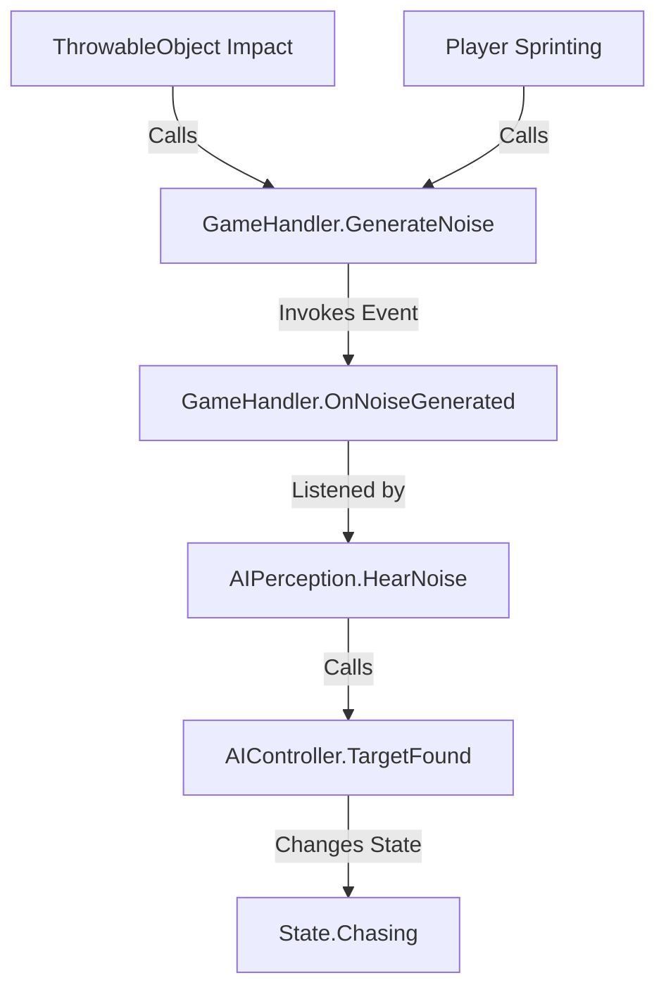
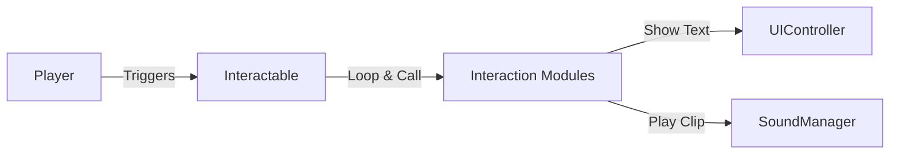

# DeepSpaceDread Code Manual

This manual provides a comprehensive overview of the scripts and systems in DeepSpaceDread, detailing how they relate to each other and how to adjust them.

## 1. Architecture Overview

DeepSpaceDread follows a **component-based architecture** typical for Unity projects, but with a strong emphasis on **modular systems** and **event-driven communication**.

- **Modularity**: Systems like Interactions are broken down into small, reusable "Modules" (e.g., `InteractionMessageModule`, `InteractionSoundModule`) that can be combined on a single GameObject.
- **Event-Driven**: Global events like noise generation are handled via the `GameHandler` singleton, allowing decoupled systems (like AI and Player) to communicate without direct references.
- **State Machines**: Both the Player and AI use state-based logic to manage complex behaviors like hunting, hiding, or death.

---

## 2. Core Systems

### 2.1 Player System

The Player system manages movement, input, health, and visibility.

- **`PlayerController.cs`**: The central hub for player logic. It handles:
    - Input processing (via `PlayerControls`).
    - State management (`Alive`, `Dead`, `Sleeping`).
    - Flashlight toggling and visibility calculations.
    - Interaction triggering.
    - Animation updates.
- **`TDPlayerMovement.cs`**: Handles the physical movement of the player using `Rigidbody2D`. It supports walking and sprinting, and includes a "Zero-G" mode triggered by game events.
- **`PlayerSounds.cs`**: Managed by the PlayerController to play footstep and action sounds based on the current movement state.
- **`Resource.cs`**: Used by the Player to track health. It supports auto-recharge and fires events when health is empty or full.
- **`InventoryController.cs`**: A simple inventory system for holding throwable objects.

**How to adjust**:
- Modify `moveSpeed` and `sprintSpeed` in `TDPlayerMovement` to change movement feel.
- Adjust `baseVisibility` and `detectionRadius` in `PlayerController` to tune how easily the AI spots the player.

### 2.2 AI System

The AI system controls enemy behavior using a state machine and sensory perception.

- **`AIController.cs`**: Manages the AI's high-level states: `Hunting`, `Chasing`, `Investigating`, `Hungry`, `Eating`, `Attacking`, `Stunned`, and `Fleeing`. It controls the `NavMeshAgent` for navigation.
- **`AIPerception.cs`**: Handles sensory input.
    - **Vision**: Uses raycasts and FOV angles to detect the player based on their visibility level.
    - **Hearing**: Listens for noise events from the `GameHandler`.
- **`AlienSounds.cs`**: Handles all audio for the alien, including walking, screaming, and eating.

**How to adjust**:
- Change `walkingSpeed` or `moveRadius` in `AIController` to alter patrol behavior.
- Adjust `viewRadius` or `viewAngle` in `AIPerception` to make the alien more or less perceptive.
- Tune `hungerRate` in `AIController` to control how often the alien seeks out corpses.

### 2.3 Interaction System

The interaction system is highly modular, allowing for complex behaviors to be built from simple components.

- **`Interactable.cs`**: The base class for all interactable objects. It handles detection of the player via triggers and displays interaction prompts.
- **`InteractionModule.cs`**: An abstract base class. You can add multiple `InteractionModule` components to an `Interactable` object. When the player interacts, all modules are executed.
    - **`InteractionMessageModule.cs`**: Displays a message from the `MessageDatabase`.
    - **`InteractionSoundModule.cs`**: Plays a specific sound effect.
    - **`InteractIndicatorModule.cs`**: Manages visual feedback for interaction.
- **Specialized Interactables**:
    - **`Locker.cs`**: Handles hiding mechanics.
    - **`Door.cs`**: Handles opening/closing logic.
    - **`ThrowableObject.cs` / `ThrowableBottle.cs`**: Objects that can be picked up, thrown, and generate noise on impact.

### 2.4 UI System

Built using Unity's UI Toolkit, the UI system is centralized for easy management.

- **`UIController.cs`**: The main controller for the UI. It manages:
    - Message display with typewriter effects.
    - Interaction prompts.
    - Game state screens (Pause, Game Over, Win).
    - Reactor interface panels.
- **`TypewriterEffect.cs`**: A utility that animates text appearing character-by-character.
- **`UI_PauseMenu.cs` & `UI_Reactor.cs`**: Component-specific UI logic.

### 2.5 Global Management

These scripts provide utility and global state management.

- **`GameHandler.cs`**: A singleton managing global events. Its most critical role is `GenerateNoise`, which notifies the AI system when something loud happens.
- **`GameAssets.cs`**: A central repository for all shared assets like audio clips and sprites, accessible via `GameAssets.instance`.
- **`SoundManager.cs`**: A static utility class used to play sounds throughout the game without needing local AudioSources.
- **`Timer.cs`**: Manages the game clock and triggers events when time runs out.
- **`MessageDatabase.cs`**: A ScriptableObject that stores all game text and dialogue, organized by keys.

---

## 3. Relationships & Data Flow

### 3.1 Noise Generation and AI Response
The following flow shows how a physical event in the game world alerts the AI:

### 3.2 Interaction Flow
How the modular interaction system works:

---

## 4. How-to Guides

### 4.1 How to Add a New Interactable Object
1.  **Create GameObject**: Create a new GameObject with a `SpriteRenderer` and a `Collider2D` (set to `Is Trigger`).
2.  **Add `Interactable` Component**: Attach the `Interactable.cs` script.
3.  **Set Prompt**: Type the interaction text (e.g., "Press E to Search") in the `Interact Text` field.
4.  **Add Modules**: Attach one or more `InteractionModule` scripts (like `InteractionMessageModule` or `InteractionSoundModule`).
5.  **Link Modules**: Drag the module components into the `Interaction Modules` list on the `Interactable` component.

### 4.2 How to Adjust AI Difficulty
- **Detection Speed**: In `AIPerception.cs`, increase `targetVisible` increments or decrease `viewRadius` to make it harder/easier for the alien to see the player.
- **Movement Speed**: Adjust `walkingSpeed` and `NavMeshAgent` speed in the `AIController` inspector.
- **Investigative Behavior**: Adjust `moveRadius` to change how far the alien wanders while hunting.

### 4.3 How to Add New Dialogue/Messages
1.  **Open Message Database**: Find the `MessageDatabase` ScriptableObject in the project assets.
2.  **Add Entry**: Add a new item to the `Message List`.
3.  **Set Key**: Give it a unique key (e.g., `Log_Storage_01`).
4.  **Write Text**: Enter the message in the `Message` text area.
5.  **Use in Game**: In an `InteractionMessageModule`, add your new key to the `Message Keys` list.
